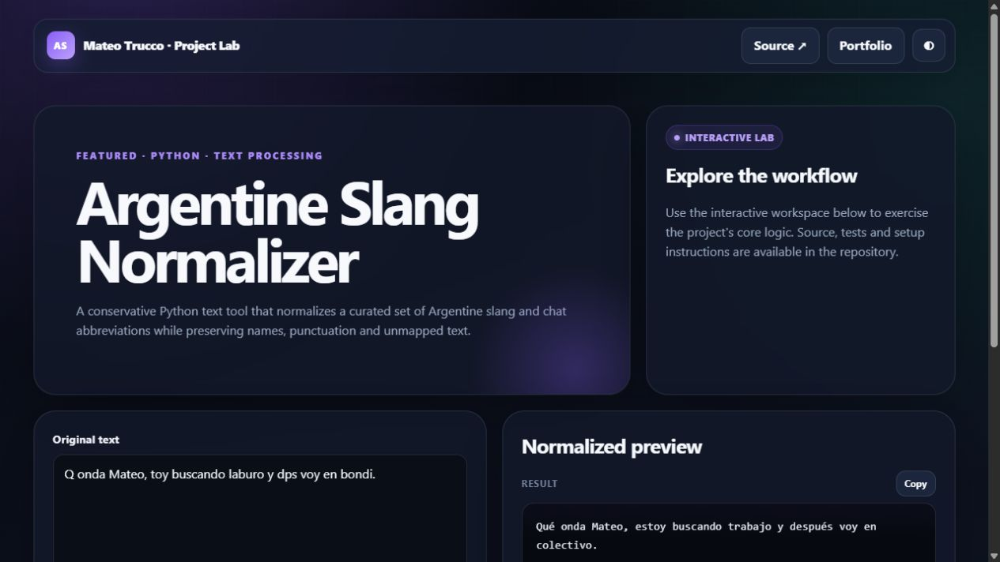

# Argentine Slang Normalizer

A conservative text-normalization tool for Argentine slang and chat abbreviations. It preserves names and punctuation, applies explicit whole-word and phrase rules, and exposes every replacement in an audit trail.

The same tested Python engine powers the Tkinter application and the live browser experience.

```bash
python main.py
python -m pytest tests
```

---

## Interactive preview

[](https://mateotrucco.github.io/argentine_slang_normalizer/)

**[Open the live experience](https://mateotrucco.github.io/argentine_slang_normalizer/)** · [View the portfolio](https://mateotrucco.github.io/)

## Engineering baseline

- Business logic separated from presentation
- Automated tests and GitHub Actions CI
- Responsive, keyboard-friendly browser experience
- MIT licensed and documented setup

